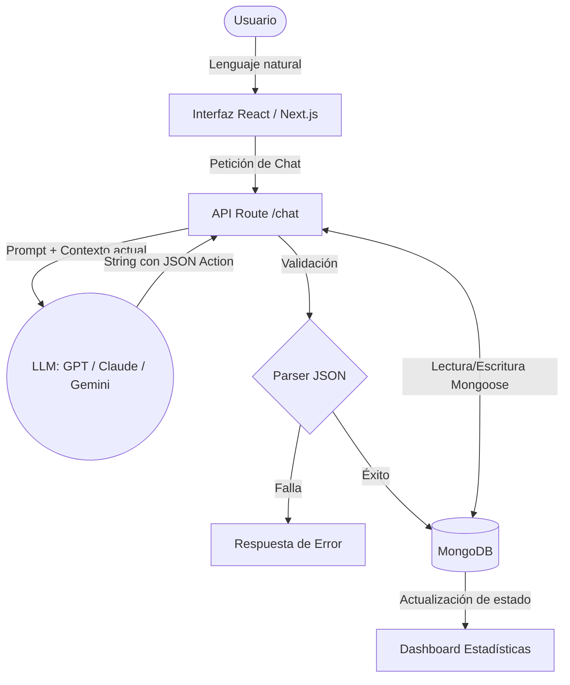

# Memoria: Stock Atelier (Agente de Inventario)

## Explicación del software desarrollado

### Definición del proceso empresarial
**Stock Atelier** aborda la gestión integral de un almacén o inventario empresarial, centrándose particularmente en:
*   Registro de reservas/compras (Entradas) asociando la mercancía a proveedores específicos.
*   Registro de mermas y salidas (caducidad, rotura o pérdida de stock).
*   Monitoreo general de stock y consultas de cantidades en tiempo real.
Este proceso, tradicionalmente llevado en hojas de cálculo complejas o ERPs con múltiples menús, se transforma en una experiencia conversacional. El usuario simplemente introduce instrucciones en lenguaje natural (ej. "Tira a la basura 5 sillas por rotura" o "Compra 10 monitores a Logitech").

### Beneficios esperados de implementar este tipo de agente
*   **Curva de aprendizaje nula:** Los usuarios no necesitan aprender a usar el software, interactúan como si solicitaran acciones a otro empleado.
*   **Agilidad operativa:** Agrupación ágil de operaciones.
*   **Mitigación de errores humanos:** El agente estructura las entradas de forma estandarizada e impide stock en negativo.
*   **Visibilidad de métricas al instante:** Extracción de dashboard en vivo (proveedores, motivos de mermas, existencias).

### Diseño funcional del agente. ¿De qué se encarga nuestro LLM?
El LLM representa el "cerebro orquestador". Su función principal es **traducir el lenguaje del usuario a objetos JSON estructurados**.
1. Se le inyecta un *System Prompt* exhaustivo con el estado actual del inventario.
2. Analiza la petición del cliente y emite un veredicto de la operación deseada (ej. `order`, `waste`, `update`, `clear_all`).
3. Retorna por un lado la respuesta textual humana ("He añadido 5 monitores a Logitech"), y por otro, incluye de forma estricta un bloque JSON que nuestra aplicación procesa.
4. El backend en Next.js atrapa ese JSON y ejecuta las interacciones CRUD hacia nuestra base de datos MongoDB, forzando la consistencia e integridad (ej. no permitir stock -2).

### Definición general con diagramas



---

## Evaluación e interpretación enfocada a comparativa entre 3 modelos

Para el desarrollo del agente se ha planteado un selector de LLMs y se han utilizado y comparado directamente tres familias distintas a través de API REST directas (`gpt-5.4-nano`, `claude-haiku-4-5` y `gemini-3.1-flash-lite`).  

### Problemas encontrados y limitaciones del sistema
*   **Límites de Infraestructura Gratuita:** En versiones tempranas probando NVIDIA NIM surgieron demasiados errores `404`, `500` e hilos en cola, lo que causaba colapsos y sobrepasaba el *timeout* (maxDuration) de Vercel (10-15s). **Solución:** Cambio hacia llamadas REST seguras mediante claves proporcionadas hacia infraestructuras oficiales propietarias.
*   **Apego al Formato / Alucinaciones:** Uno de los principales fallos fue que los agentes a veces se volvían "conversadores" e ignoraban la obligación de imprimir código JSON, o utilizaban mal las comillas de Markdown (limitando el parsing estricto del servidor). Se tuvo que robustecer muchísimo el System Prompt para forzar al modelo a ser frío y sistemático y añadir funciones regex adaptables al servidor.

### ¿Cómo te has servido de la IA generativa para este proyecto?
La IA generativa (principalmente el agente GitHub Copilot / Gemini 3.1 Pro en VS Code) fue clave para construir la aplicación en tiempo récord:
1.  **Fundación Full-Stack:** Generación de modelos de Mongoose (`Product.ts`, `Order.ts`, `Waste.ts`, `Supplier.ts`) y rutas de la API App Router.
2.  **Solución de Bugs complejos:** Asistencia decodificando los problemas de concurrencia y formato JSON entre la respuesta del LLM y el Typescript.
3.  **Diseño End-to-End:** Utilización de Tailwind CSS para maquetar toda la interfaz visual y uso de `chart.js` para generar los diagramas en base a la información extraída de la DB.

### ¿Podría haber hecho más eficiente alguna parte de la práctica?
Sí. El mecanismo en el que le obligamos al modelo a "escribir texto" seguido de un "```json ...```" que el servidor localiza mediante expresiones regulares `Regex()`, aunque funciona, **no es la herramienta idónea a nivel empresarial moderno**. 
Lo óptimo hubiese sido incorporar **Tool Calling (Function Calling)** de manera nativa utilizando los SDKs oficiales de OpenAI o Vercel AI SDK, forzando a que las respuestas formen un payload predecible sin *hacks* en texto plano.

### ¿Tiene sentido este tipo de implementaciones, obtenemos el resultado esperado?
Totalmente. Se logró el objetivo. Transformar el proceso de meter y sacar pedidos, que requeriría normalmente un CRUD tradicional aburrido de "Selecciona campo, inserta número, clickea el proveedor..." en una experiencia donde basta con escribir *"Acaban de entrar unos 20 teclados ASUS"*, lo que otorga una extrema productividad e inmediatez. Muestra el verdadero potencial del LLM integrándose con Bases de Datos y no solo como un bot que "habla".
